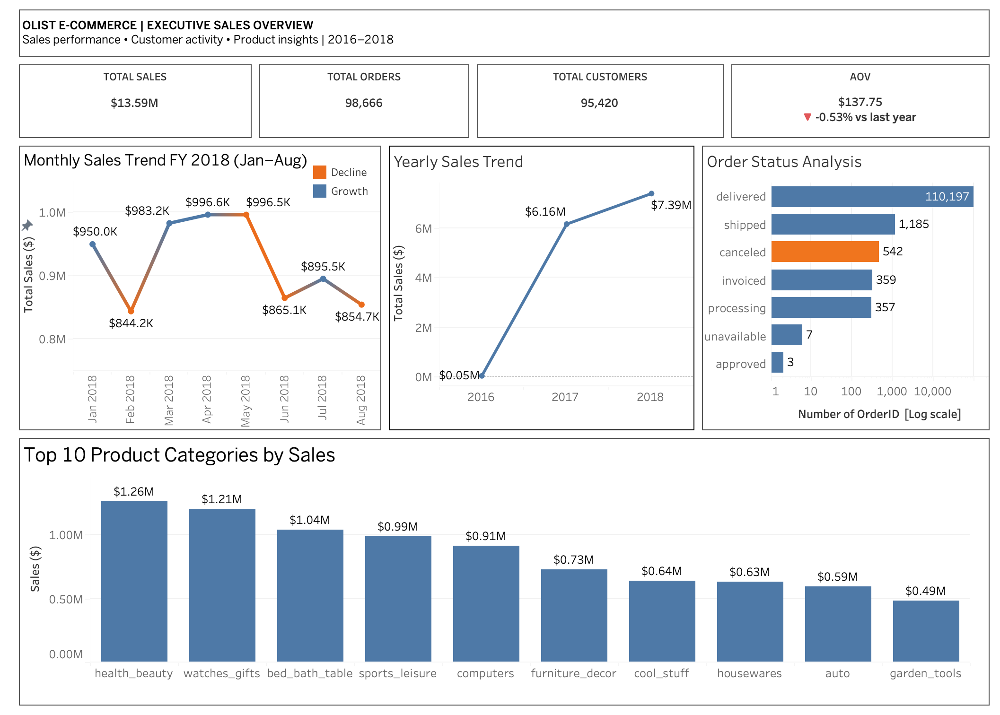

# Olist E-Commerce Dashboard

An end-to-end data analytics portfolio project analyzing the Brazilian Olist e-commerce dataset — from raw data profiling through warehouse modeling to an interactive executive dashboard.

**Live Dashboard:** [View on Tableau Public](https://public.tableau.com/app/profile/swayanka.das/viz/Olist_Dashboard_17880506553140/ExecutiveSalesDashboard)



---

## Project Overview

This project explores Olist's e-commerce order data (2016–2018) to answer key business questions around sales performance, customer activity, and product trends — packaged into a single executive-level Tableau dashboard.

**Business questions explored:**
- How has sales performance trended year over year?
- Which product categories drive the most revenue?
- What does the order fulfillment/cancellation breakdown look like?
- Are there seasonal patterns worth investigating further?

---

## Tech Stack

| Stage | Tool |
|---|---|
| Data Source | [Kaggle — Brazilian E-Commerce Public Dataset by Olist](https://www.kaggle.com/datasets/olistbr/brazilian-ecommerce) |
| Data Profiling | Python (Pandas, Jupyter Notebook) |
| Data Warehouse | PostgreSQL |
| Transformation / Modeling | dbt (staging → intermediate → marts) |
| Visualization | Tableau Public |

**Pipeline:**
```
Kaggle CSVs → Python (profiling) → PostgreSQL (raw storage) → dbt (fact/dim modeling) → Tableau (dashboard)
```

---

## Key Insights

- **Sales growth:** Total sales grew from ~$49.8K (2016) to ~$7.39M (2018), reflecting Olist's rapid marketplace expansion.
- **Order cancellations:** ~542 orders (roughly 0.5% of total) were canceled — a relatively low and healthy cancellation rate.
- **Top categories:** `health_beauty`, `watches_gifts`, and `bed_bath_table` are the top three revenue-driving product categories.
- **Seasonal dips:** Notable sales dips in February and June–August 2018 loosely align with Brazil's Carnival season and the 2018 FIFA World Cup period — a hypothesis worth further validation against confirmed event calendars rather than a confirmed causal claim.

---

## Repository Structure

```
olist-ecommerce-dashboard/
├── README.md
├── 01_Data_Profiling.ipynb      # Python data profiling & quality checks
├── dbt_project.yml
├── models/
│   ├── staging/                 # Cleaned, typed source tables
│   ├── intermediate/            # Business logic transformations
│   └── marts/                   # Final fact & dimension tables
├── seeds/
├── snapshots/
├── tests/
├── macros/
├── analyses/
├── tableau/
│   └── Olist_Dashboard.twbx     # Packaged Tableau workbook
├── images/
│   └── dashboard_screenshot.png
└── docs/                        # Additional write-ups / insights
```

---

## How to Reproduce

1. Download the raw CSVs from the [Kaggle dataset](https://www.kaggle.com/datasets/olistbr/brazilian-ecommerce).
2. Run `01_Data_Profiling.ipynb` to profile and validate the raw data.
3. Load the raw tables into a PostgreSQL database.
4. Configure your `profiles.yml` for dbt to point at your Postgres instance.
5. Run `dbt run` and `dbt test` to build and validate the staging, intermediate, and mart models.
6. Open `tableau/Olist_Dashboard.twbx` in Tableau Desktop/Public, connect to your modeled tables, and explore.

---

## Author

**Swayanka Das**
[LinkedIn](https://www.linkedin.com/in/swayankadas/) • [Tableau Public Profile](https://public.tableau.com/app/profile/swayanka.das)
